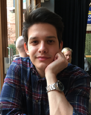

+++
date = "2018-06-10T10:00:33+05:30"
title = "Code and Crayons"
+++

The guy behind **Code and Crayons** is me - Christopher. I reside in Gothenburg, Sweden, together with my wife and our daughter. I am an avid gamer and technology enthusiast which, of course, greatly influenced my choice of career.

In 2009 I started the Civilengineering in Game and Software Development programme at Blekinge Institute of Technology in Karlskrona, Sweden. It was a five year long education with focus on C++ and game development. When I completed my studies I moved back to Gothenburg looking for employment within the game industry, but it was a lot harder to find employment within this field than I had imagined. I was offered a position as a junior mobile developer at HiQ through a consultant company known as New Minds, and has since 2014 worked with precisely that.

After a year at New Minds my contract was turned into an employement at HiQ, where I stayed for another 3 years. During my years at HiQ I have had the opportunity to work for a range of different companies, with various sizes, such as Electrolux, SKF, Essgroup, Parkeringsbolaget, Volvo, and many others.

After HiQ I decided to try my luck at a product company instead, and found [SleepCycle AB][2] where I have been employed as an iOS developer since 2017. At Sleep Cycle I have had the privilege to work a lot more closely to the everyday user, and with a team that do not compromise with quality, user experience, or code structure. The first year or so I worked on one of their smaller apps, but has since been moved to their flagship app [Sleep Cycle][3] where I work on the iOS version.

		

 

	<h2>Christopher Vikner</h2>

[2]: https://www.sleepcycle.com/
[3]: https://itunes.apple.com/app/apple-store/id320606217